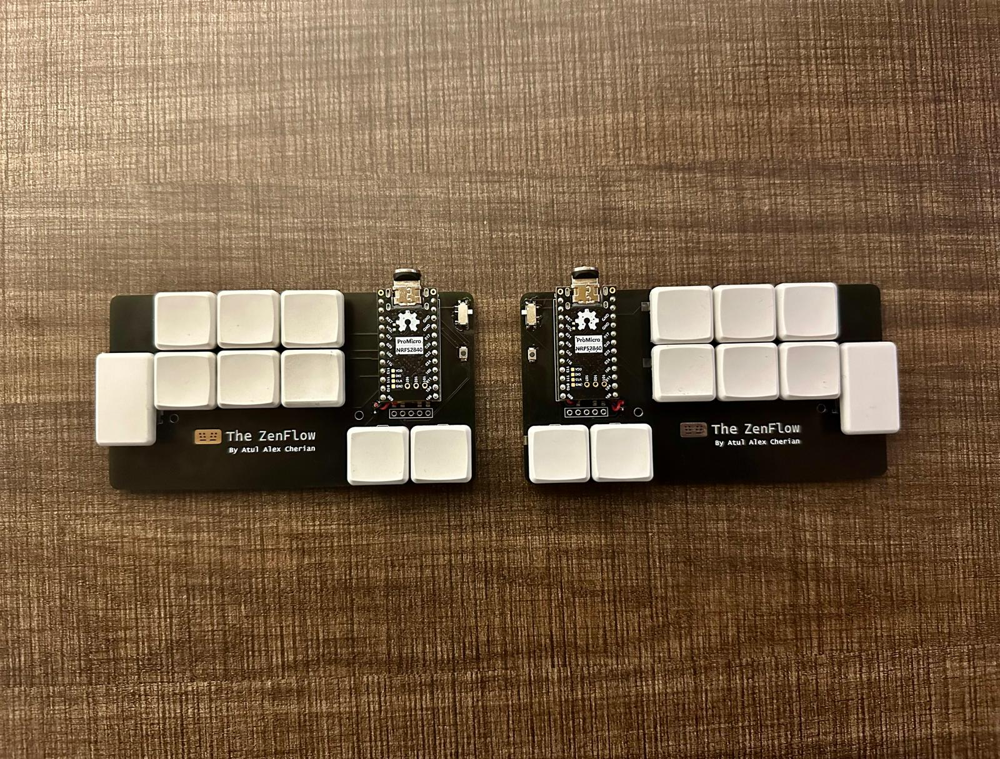

# ZenFlow
## My endgame 18 key custom keyboard 

ZenFlow is a fully custom split wireless keyboard made using Ergogen + KiCad. It's powered by [ZMK](https://zmk.dev/). Check [keymap](./keymap) for more details. 
## Features

- 18 keys
- Split, ortholinear
- Fully wireless, compatible with ZMK
- Supports both hot-swap as well as direct soldering of Kailh Choc v1 switches
- Supports nice!view displays
- Reversible PCB
- Mounting holes for a case

Note: `Solder all the reversible pads & components (except battery, power switch & reset button) on the bottom side of each half as instructed on the PCB` 

## Requirements
| Part | Specification |
| ------ | ------ |
| MCU | 2x nice!nano or SuperMini |
| Battery | 2x Lipo battery (301230)|
| Power switch | 2x MSK-12C02 or compatible |
| Reset button | 2x B3U-1000P(M) |
| Switches | 18x Kailh Choc v1 |
| Keycaps | 16x Kailh Choc v1 1u & 2x Kailh Choc v1 2u |
| Hotswap sockets (Optional) | 18x Kailh Choc v1 |
| Display (Optional) | 2x nice!view |

## Credits
- Ben Vallack for the videos & his Piano keyboard for inspiration
- [Ergogen](https://docs.ergogen.xyz/) which was used for most of the designing & FlatFootFox for the tutorial series 
- [ZMK](https://zmk.dev/) community in general
