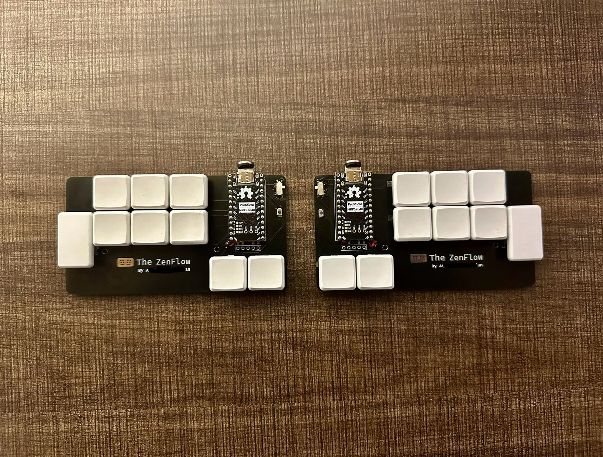

# ZenFlow
## My endgame 18 key custom keyboard 

ZenFlow is a fully custom split wireless keyboard made using Ergogen + KiCad. It's powered by ZMK.
## Features

- 18 keys
- Split
- Fully wireless to be used with ZMK
- Supports both hot-swap as well as direct soldering of Choc V1 switches
- Supports Nice!View displays
- Reversible PCB
- Mouting holes for a case

Note: `Solder all the reversible pads on the bottom side of each half as instructed on the PCB` 
