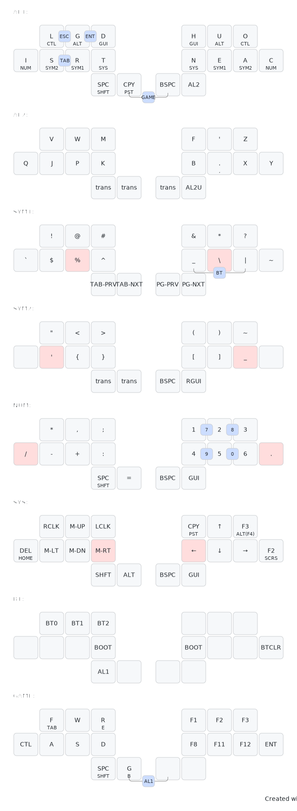

## ZenFlow keymap 


##### Created using Keymap Drawer (https://keymap-drawer.streamlit.app/)
```sh
# zenFlow keymap
layout:
  ortho_layout:
    split: true
    rows: 2
    columns: 5
    thumbs: 2
layers:
  AL1:
    # left upper five (0.0 - 0.4)
    - { t: "", h: "", type: ghost }
    - { t: "L", h: "CTL" }
    - { t: "G", h: "ALT" }
    - { t: "D", h: "GUI" }
    - { t: "", h: "", type: ghost }
    # right upper five (0.5 - 0.9)
    - { t: "", h: "", type: ghost }
    - { t: "H", h: "GUI" }
    - { t: "U", h: "ALT" }
    - { t: "O", h: "CTL" }
    - { t: "", h: "", type: ghost }
    # left home five (1.0 - 1.4)
    - { t: "I", h: "NUM" }
    - { t: "S", h: "SYM2" }
    - { t: "R", h: "SYM1" }
    - { t: "T", h: "SYS" }
    - { t: "", h: "", type: ghost }
    # right home five (1.5 - 1.9)
    - { t: "", h: "", type: ghost }
    - { t: "N", h: "SYS" }
    - { t: "E", h: "SYM1" }
    - { t: "A", h: "SYM2" }
    - { t: "C", h: "NUM" }
    # thumbs
    - { t: "SPC", h: "SHFT" }
    - { t: "CPY", h: "PST" }
    - { t: "BSPC", h: "" }
    - { t: "AL2", h: "" }
  AL2:
    # left upper five (0.0 - 0.4)
    - { t: "", h: "", type: ghost }
    - { t: "V", h: "" }
    - { t: "W", h: "" }
    - { t: "M", h: "" }
    - { t: "", h: "", type: ghost }
    # right upper five (0.5 - 0.9)
    - { t: "", h: "", type: ghost }
    - { t: "F", h: "" }
    - { t: "'", h: "" }
    - { t: "Z", h: "" }
    - { t: "", h: "", type: ghost }
    # left home five (1.0 - 1.4)
    - { t: "Q", h: "" }
    - { t: "J", h: "" }
    - { t: "P", h: "" }
    - { t: "K", h: "" }
    - { t: "", h: "", type: ghost }
    # right home five (1.5 - 1.9)
    - { t: "", h: "", type: ghost }
    - { t: "B", h: "" }
    - { t: ".", h: "," }
    - { t: "X", h: "" }
    - { t: "Y", h: "" }
    # thumbs
    - { t: "trans", h: "" }
    - { t: "trans", h: "" }
    - { t: "trans", h: "" }
    - { t: "AL2U", h: "" }
  SYM1:
    # left upper five (0.0 - 0.4)
    - { t: "", h: "", type: ghost }
    - { t: "!", h: "" }
    - { t: "@", h: "" }
    - { t: "#", h: "" }
    - { t: "", h: "", type: ghost }
    # right upper five (0.5 - 0.9)
    - { t: "", h: "", type: ghost }
    - { t: "&", h: "" }
    - { t: "*", h: "" }
    - { t: "?", h: "" }
    - { t: "", h: "", type: ghost }
    # left home five (1.0 - 1.4)
    - { t: "`", h: "" }
    - { t: "$", h: "" }
    - { t: "%", h: "", type: held }
    - { t: "^", h: "" }
    - { t: "", h: "", type: ghost }
    # right home five (1.5 - 1.9)
    - { t: "", h: "", type: ghost }
    - { t: "_", h: "" }
    - { t: "\\", h: "", type: held }
    - { t: "|", h: "" }
    - { t: "~", h: "" }
    # thumbs
    - { t: "trans", h: "" }
    - { t: "trans", h: "" }
    - { t: "trans", h: "" }
    - { t: "RGUI", h: "" }
  SYM2:
    # left upper five (0.0 - 0.4)
    - { t: "", h: "", type: ghost }
    - { t: "\"", h: "" }
    - { t: "<", h: "" }
    - { t: ">", h: "" }
    - { t: "", h: "", type: ghost }
    # right upper five (0.5 - 0.9)
    - { t: "", h: "", type: ghost }
    - { t: "(", h: "" }
    - { t: ")", h: "" }
    - { t: "~", h: "" }
    - { t: "", h: "", type: ghost }
    # left home five (1.0 - 1.4)
    - { t: "", h: "" }
    - { t: "'", h: "", type: held }
    - { t: "{", h: "" }
    - { t: "}", h: "" }
    - { t: "", h: "", type: ghost }
    # right home five (1.5 - 1.9)
    - { t: "", h: "", type: ghost }
    - { t: "[", h: "" }
    - { t: "]", h: "" }
    - { t: "_", h: "", type: held }
    - { t: "", h: "" }
    # thumbs
    - { t: "trans", h: "" }
    - { t: "trans", h: "" }
    - { t: "trans", h: "" }
    - { t: "RGUI", h: "" }
  NUM:
    # left upper five (0.0 - 0.4)
    - { t: "", h: "", type: ghost }
    - { t: "*", h: "" }
    - { t: ",", h: "" }
    - { t: ";", h: "" }
    - { t: "", h: "", type: ghost }
    # right upper five (0.5 - 0.9)
    - { t: "", h: "", type: ghost }
    - { t: "1", h: "" }
    - { t: "2", h: "" }
    - { t: "3", h: "" }
    - { t: "", h: "", type: ghost }
    # left home five (1.0 - 1.4)
    - { t: "/", h: "", type: held }
    - { t: "-", h: "" }
    - { t: "+", h: "" }
    - { t: ":", h: "" }
    - { t: "", h: "", type: ghost }
    # right home five (1.5 - 1.9)
    - { t: "", h: "", type: ghost }
    - { t: "4", h: "" }
    - { t: "5", h: "" }
    - { t: "6", h: "" }
    - { t: ".", h: "", type: held }
    # thumbs
    - { t: "SPC", h: "SHFT" }
    - { t: "=", h: "" }
    - { t: "trans", h: "" }
    - { t: "GUI", h: "" }
  SYS:
    # left upper five (0.0 - 0.4)
    - { t: "", h: "", type: ghost }
    - { t: "RCLK", h: "" }
    - { t: "M-UP", h: "" }
    - { t: "LCLK", h: "" }
    - { t: "", h: "", type: ghost }
    # right upper five (0.5 - 0.9)
    - { t: "", h: "", type: ghost }
    - { t: "CPY", h: "PST" }
    - { t: "↑", h: "" }
    - { t: "F3", h: "ALT(F4)" }
    - { t: "", h: "", type: ghost }
    # left home five (1.0 - 1.4)
    - { t: "DEL", h: "HOME" }
    - { t: "M-LT", h: "" }
    - { t: "M-DN", h: "" }
    - { t: "M-RT", h: "", type: held }
    - { t: "", h: "", type: ghost }
    # right home five (1.5 - 1.9)
    - { t: "", h: "", type: ghost }
    - { t: "←", h: "", type: held }
    - { t: "↓", h: "" }
    - { t: "→", h: "" }
    - { t: "F2", h: "SCRS" }
    # thumbs
    - { t: "SHFT", h: "" }
    - { t: "ALT", h: "" }
    - { t: "trans", h: "" }
    - { t: "GUI", h: "" }
  BT:
    # left upper five (0.0 - 0.4)
    - { t: "", h: "", type: ghost }
    - { t: "BT0", h: "" }
    - { t: "BT1", h: "" }
    - { t: "BT2", h: "" }
    - { t: "", h: "", type: ghost }
    # right upper five (0.5 - 0.9)
    - { t: "", h: "", type: ghost }
    - { t: "", h: "" }
    - { t: "", h: "" }
    - { t: "", h: "" }
    - { t: "", h: "", type: ghost }
    # left home five (1.0 - 1.4)
    - { t: "", h: "" }
    - { t: "", h: "" }
    - { t: "", h: "" }
    - { t: "BOOT", h: "" }
    - { t: "", h: "", type: ghost }
    # right home five (1.5 - 1.9)
    - { t: "", h: "", type: ghost }
    - { t: "BOOT", h: "" }
    - { t: "", h: "" }
    - { t: "", h: "" }
    - { t: "BTCLR", h: "" }
    # thumbs
    - { t: "AL1", h: "" }
    - { t: "", h: "" }
    - { t: "", h: "" }
    - { t: "", h: "" }
  GAME:
    # left upper five (0.0 - 0.4)
    - { t: "", h: "", type: ghost }
    - { t: "F", h: "TAB" }
    - { t: "W", h: "" }
    - { t: "R", h: "E" }
    - { t: "", h: "", type: ghost }
    # right upper five (0.5 - 0.9)
    - { t: "", h: "", type: ghost }
    - { t: "F1", h: "" }
    - { t: "F2", h: "" }
    - { t: "F3", h: "" }
    - { t: "", h: "", type: ghost }
    # left home five (1.0 - 1.4)
    - { t: "CTL", h: "" }
    - { t: "A", h: "" }
    - { t: "S", h: "" }
    - { t: "D", h: "" }
    - { t: "", h: "", type: ghost }
    # right home five (1.5 - 1.9)
    - { t: "", h: "", type: ghost }
    - { t: "F8", h: "" }
    - { t: "F11", h: "" }
    - { t: "F12", h: "" }
    - { t: "ENT", h: "" }
    # thumbs
    - { t: "SPC", h: "SHFT" }
    - { t: "G", h: "B" }
    - { t: "", h: "" }
    - { t: "", h: "" }

combos:
  # Numbers
  - { p: [6, 7], k: "7", layers: [NUM] }
  - { p: [7, 8], k: "8", layers: [NUM] }
  - { p: [16, 17], k: "9", layers: [NUM] }
  - { p: [17, 18], k: "0", layers: [NUM] }
  # Mouse
  #- { p: [16, 17], k: "RCLK", layers: [SYS] }
  #- { p: [6, 7], k: "LCLK", layers: [SYS] }
  # Operators
  - { p: [2, 3], k: "ENT", layers: [AL1] }
  - { p: [1, 2], k: "ESC", layers: [AL1] }
  - { p: [11, 12], k: "TAB", layers: [AL1] }
  # Bluetooth
  - { p: [16, 18], k: "BT", a: bottom, layers: [SYM1] }
  # Enter Game layer
  - { p: [21, 22], k: "GAME", a: bottom, layers: [AL1] }
  # Exit Game layer
  - { p: [21, 22], k: "AL1", a: bottom, layers: [GAME] }

# this goes into the "configuration" code/text box at the bottom of the website!
draw_config:
  append_colon_to_layer_header: true
  arc_radius: 6.0
  arc_scale: 1.0
  combo_h: 26.0
  combo_w: 28.0
  inner_pad_h: 2.0
  inner_pad_w: 2.0
  key_h: 56.0
  key_rx: 6.0
  key_ry: 6.0
  key_w: 60.0
  line_spacing: 1.2
  outer_pad_h: 56.0
  outer_pad_w: 30.0
  small_pad: 5.0
  split_gap: 30.0
  svg_style: |
    /* font and background color specifications */
    svg {
        font-family: SFMono-Regular,Consolas,Liberation Mono,Menlo,monospace;
        font-size: 14px;
        font-kerning: normal;
        text-rendering: optimizeLegibility;
        fill: #24292e;
    }

    /* default key styling */
    rect {
        fill: #f6f8fa;
        stroke: #c9cccf;
        stroke-width: 1;
    }

    /* color accent for combo boxes */
    rect.combo {
        fill: #cdf;
    }

    /* color accent for held keys */
    rect.held, rect.combo.held {
        fill: #fdd;
    }

    /* color accent for ghost (optional) keys */
    rect.ghost, rect.combo.ghost {
        fill: #fff0;
        stroke-width: 0;
    }

    text {
        text-anchor: middle;
        dominant-baseline: middle;
    }

    /* styling for layer labels */
    text.label {
        font-weight: bold;
        text-anchor: start;
        stroke: white;
        stroke-width: 2;
        paint-order: stroke;
    }

    /* styling for combo tap, and key hold/shifted label text */
    text.combo, text.hold, text.shifted {
        font-size: 11px;
    }

    text.hold {
        text-anchor: middle;
        dominant-baseline: auto;
    }

    text.shifted {
        text-anchor: middle;
        dominant-baseline: hanging;
    }

    /* styling for hold/shifted label text in combo box */
    text.combo.hold, text.combo.shifted {
        font-size: 8px;
    }

    /* styling for combo dendrons */
    path {
        stroke-width: 1;
        stroke: gray;
        fill: none;
    }
```
